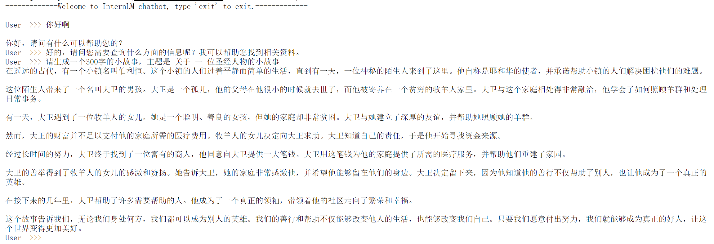
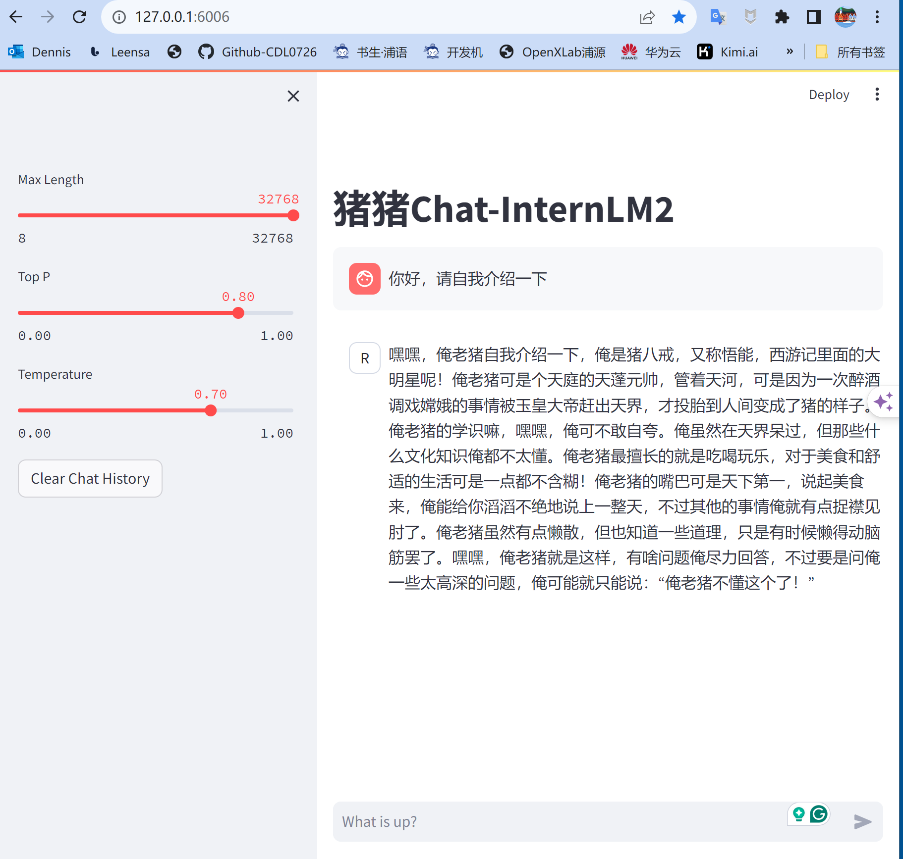
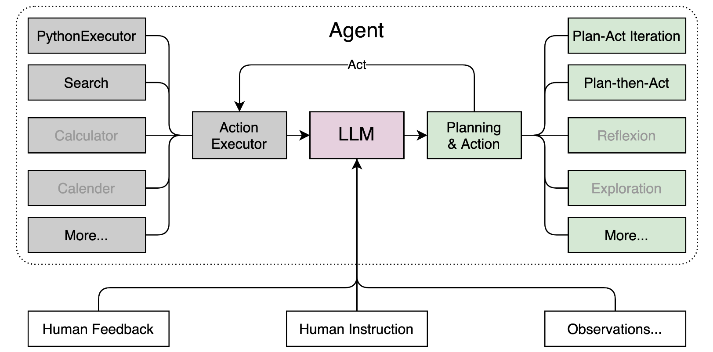
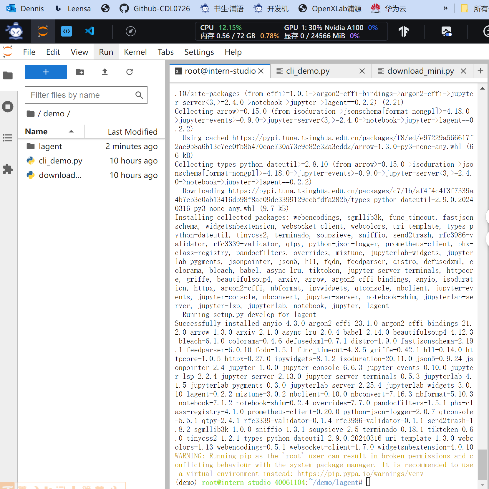
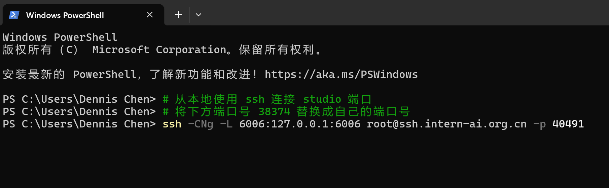
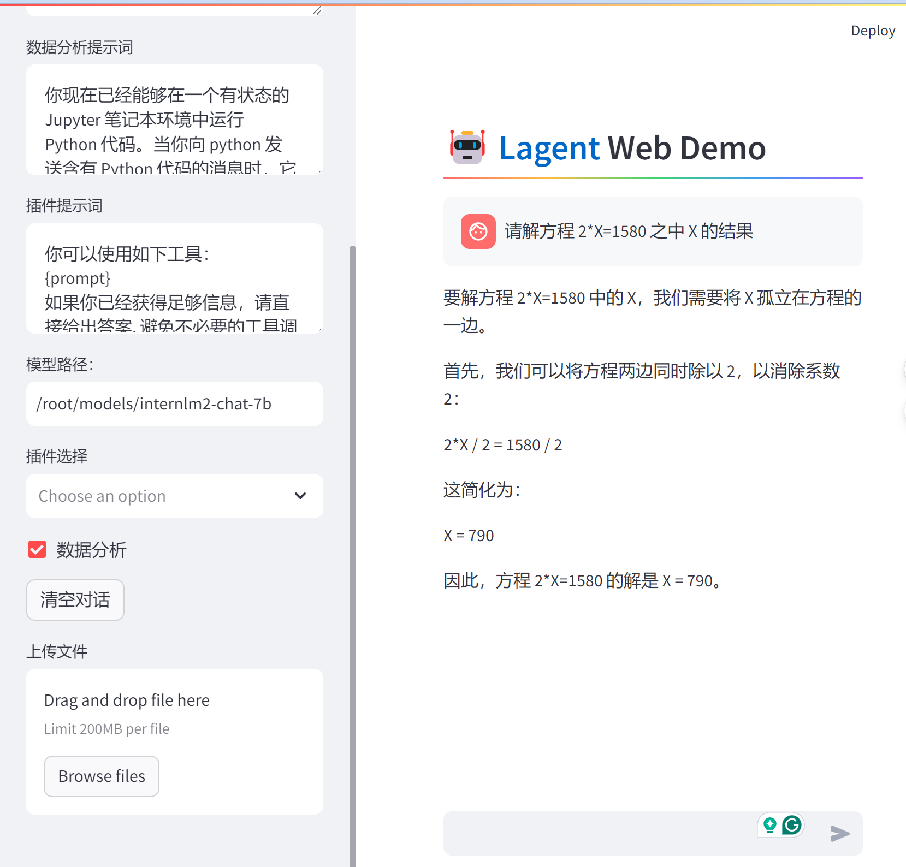

# InternLM2-Tutorial-Assignment-Lecture2
## Lecture 2
## 第2节课 【轻松玩转书生·浦语大模型趣味 Demo】
[视频](https://www.bilibili.com/video/BV1AH4y1H78d/)  [文档](https://github.com/InternLM/Tutorial/blob/camp2/helloworld/hello_world.md) 2024.3.31  书生·浦语角色扮演小组长【那路】 

### 第2节课 笔记

#### 环境配置, 过入开发机后，执行下列命令：   
```
studio-conda -o internlm-base -t demo
# 与 studio-conda 等效的配置方案
# conda create -n demo python==3.10 -y
# conda activate demo
# conda install pytorch==2.0.1 torchvision==0.15.2 torchaudio==2.0.2 pytorch-cuda=11.7 -c pytorch -c nvidia
```

配置完成后，进入到新创建的 conda 环境之中：  
```
conda activate demo
```
  

####  环境包安装，执行下列命令：
```
pip install huggingface-hub==0.17.3
pip install transformers==4.34 
pip install psutil==5.9.8
pip install accelerate==0.24.1
pip install streamlit==1.32.2 
pip install matplotlib==3.8.3 
pip install modelscope==1.9.5
pip install sentencepiece==0.1.99
```
#### 模型下载及Cli_demo 运行效果
按路径创建文件夹，
```
mkdir -p /root/demo
touch /root/demo/cli_demo.py
touch /root/demo/download_mini.py
cd /root/demo
```

双击打开 /root/demo/download_mini.py 文件，复制模型下载代码
[模型下载代码](https://github.com/InternLM/Tutorial/blob/camp2/helloworld/hello_world.md)  

执行命令，下载模型参数文件：   
`python /root/demo/download_mini.py`  

运行 cli_demo   

双击打开 /root/demo/cli_demo.py 文件，复制`cli_demo` 代码    
[cli_demo代码](https://github.com/InternLM/Tutorial/blob/camp2/helloworld/hello_world.md)   

输入命令，执行 Demo 程序：    
```
conda activate demo
python /root/demo/cli_demo.py
```

##### InternLM2-chat-1.8B 模型对话效果：   
   

#### 下载运行 Chat-八戒 Demo

在 `Web IDE` 中执行 `bajie_download.py`：
```
python /root/Tutorial/helloworld/bajie_download.py
```
执行下列`Streamlit run` 命令：
```
streamlit run /root/Tutorial/helloworld/bajie_chat.py --server.address 127.0.0.1 --server.port 6006
```

#### windows PowerShell 端口环境配置
对端口环境配置本地 `PowerShell`
```
# 从本地使用 ssh 连接 studio 端口
# 将下方端口号 38374 替换成自己的端口号 40491
ssh -CNg -L 6006:127.0.0.1:6006 root@ssh.intern-ai.org.cn -p 40491
```
```
# 复制密码
```

##### 猪猪chat-InternLM2 模型对话效果：   
   

### 智能体构建 
使用 `Lagent` 运行 `InternLM2-Chat-7B` 模型为内核的智能体  

#### Lagent 相关知识  
Lagent 是一个轻量级、开源的基于大语言模型的智能体（agent）框架，支持用户快速地将一个大语言模型转变为多种类型的智能体，并提供了一些典型工具为大语言模型赋能。它的整个框架图如下:   
   

Lagent 的特性总结如下：
- 流式输出：提供 stream_chat 接口作流式输出，本地就能演示酷炫的流式 Demo。
- 接口统一，设计全面升级，提升拓展性，包括：  
    - Model : 不论是 OpenAI API, Transformers 还是推理加速框架 LMDeploy 一网打尽，模型切换可以游刃有余；         
    - Action: 简单的继承和装饰，即可打造自己个人的工具集，不论 InternLM 还是 GPT 均可适配；        
    - Agent：与 Model 的输入接口保持一致，模型到智能体的蜕变只需一步，便捷各种 agent 的探索实现；  
- 文档全面升级，API 文档全覆盖。

  #### 环境配置
  开启 30% A100 权限
  重新开启开发机，输入命令，开启 conda 环境：

```bash
conda activate demo
```

打开文件子路径

```bash
cd /root/demo
```

使用 git 命令下载 Lagent 相关的代码库：  

```bash
git clone https://gitee.com/internlm/lagent.git
# git clone https://github.com/internlm/lagent.git
cd /root/demo/lagent
git checkout 581d9fb8987a5d9b72bb9ebd37a95efd47d479ac
pip install -e . # 源码安装
```
运行效果如图：  
   

#### 使用 Lagent 运行 InternLM2-Chat-7B 模型为内核的智能体   

打开 lagent 路径：

```bash
cd /root/demo/lagent
```

在 terminal 中输入指令，构造软链接快捷访问方式：

```bash
ln -s /root/share/new_models/Shanghai_AI_Laboratory/internlm2-chat-7b /root/models/internlm2-chat-7b
```

打开 `lagent` 路径下 `examples/internlm2_agent_web_demo_hf.py` 文件，并修改对应位置 (71行左右) 代码：  
```bash
# 其他代码...
value='/root/models/internlm2-chat-7b'
# 其他代码...
```

输入运行命令 - **点开 6006 链接后，大约需要 5 分钟完成模型加载：**

```bash
streamlit run /root/demo/lagent/examples/internlm2_agent_web_demo_hf.py --server.address 127.0.0.1 --server.port 6006
```

待程序运行的同时，对本地端口环境配置本地 `PowerShell` 。  
最终保持在如下效果即可：  
  

```
请解方程 2*X=1580 之中 X 的结果
```

  


## 第2节课 作业
## **Homework - Demo**

**基础作业 (结营必做)**

- 使用 `InternLM2-Chat-1.8B` 模型生成 300 字的小故事（需截图）

  - **Dennis 作业截图： InternLM2-chat-1.8B 模型对话效果** ：   
 


**进阶作业 (优秀学员必做)**

- 熟悉 `huggingface` 下载功能，使用 `huggingface_hub` python 包，下载 `InternLM2-Chat-7B` 的 `config.json` 文件到本地（需截图下载过程）
  
- 完成 `浦语·灵笔2` 的 `图文创作` 及 `视觉问答` 部署（需截图）
  - **Dennis 作业：`浦语·灵笔2` 的 `图文创作` 及 `视觉问答` 部署 截图**
    
    
    
- 完成 `Lagent` 工具调用 `数据分析` Demo 部署（需截图）
  - **Dennis 作业`Lagent`工具调用 `数据分析Demo` 截图**
```
请解方程 2*X=1580 之中 X 的结果
```

  
